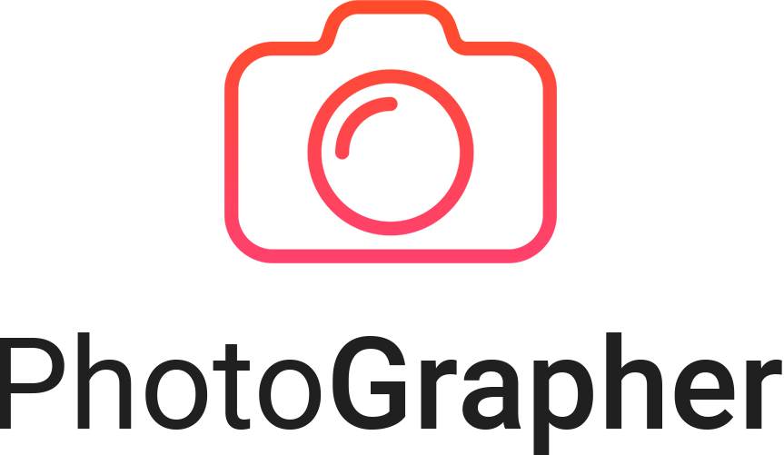

<p align="center">
    
</p>
<p align="center">
    One page de estúdio fotográfico fictício feito com Bootstrap 5
</p>
<br><br><br>
<p align="center">
    
<p>

## Sobre

Uma **One page** é uma página que contém as informações mais importantes em seu único **index**. Por conta disso, decidi criar uma One page com o aúxilio do framework front-end **Bootstrap** em sua mais nova e completa versão, a 5.

## Conteúdo da One Page
- Apresentação;
- O que fazemos;
- Nossos projetos;
- Contato.

## Instalação

Baixe o repositório em sua máquina:
```
git clone https://github.com/willaug/Photographer.git
```
Acesse a pasta principal:
```
cd Photographer
```

## Construído com o aúxilio de

- [Bootstrap v5](https://getbootstrap.com/) (Framework front-end);
- [FontAwesome](https://fontawesome.com/) (Ícones);
- [Unsplash](https://unsplash.com/) (Imagens de exemplo);
- [Freepik](https://www.freepik.com/) (Illustração);

## Autor

Feito por William Augusto
📧 william.santos315@outlook.com

## Despedida

Obrigado por visitar meu projeto, você é livre para dar um feedback ou usa-lo como referência para os seus projetos. Obrigado, até mais! 😊
